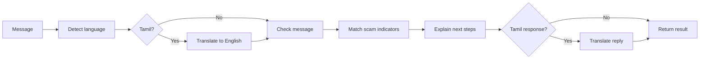

# PolyCyGot

**A second opinion for suspicious messages.** PolyCyGot checks a message for common scam signals and explains what to do next, in English or Tamil.

> Got a message asking for an OTP, money, or an urgent link click? Paste it in and inspect the signals before you act.

<p align="center">
	<a href="#-get-running">Get running</a> ·
	<a href="#-try-a-message">Try a message</a> ·
	<a href="#-how-it-works">How it works</a> ·
	<a href="#-api-at-a-glance">API</a>
</p>

---

## Quick navigation

<details open>
<summary><strong>Choose where to go</strong></summary>

- [What it checks](#-what-it-checks)
- [Run locally](#-get-running)
- [Try a message](#-try-a-message)
- [How it works](#-how-it-works)
- [API reference](#-api-at-a-glance)
- [Privacy and limitations](#-privacy-and-limitations)

</details>

## 🔎 What it checks

| Signal | Example clue | Suggested next step |
| --- | --- | --- |
| OTP request | “Send your verification code” | Never share an OTP with anyone. |
| Urgent threat | “Your account will be blocked today” | Pause and verify through an official channel. |
| Suspicious link | “Click here to verify your account” | Open the official app or type its address yourself. |
| Payment request | “Pay this fee immediately” | Confirm the request independently before paying. |

PolyCyGot returns matching indicators, a suggested response, and whether it needs more details. It can detect a message language and translate between English and Tamil using Sarvam AI.

## 🚀 Get running

You’ll need Python, Node.js with npm, and a Sarvam API key for language detection and translation.

<details>
<summary><strong>1. Start the backend</strong></summary>

From the repository root:

```bash
cd backend
python -m venv .venv
source .venv/bin/activate
pip install -r requirements.txt
```

Create `backend/.env` and add your key:

```env
SARVAM_API_KEY=your_api_key
```

Run the API:

```bash
uvicorn main:app --reload
```

The API is available at `http://127.0.0.1:8000`. Interactive API docs are at [`/docs`](http://127.0.0.1:8000/docs).

</details>

<details>
<summary><strong>2. Start the frontend</strong></summary>

In a second terminal, from the repository root:

```bash
cd frontend
npm install
npm run dev
```

Open the local URL printed by Vite, usually `http://localhost:5173`.

</details>

## 💬 Try a message

Paste a message into the app, or send a request directly:

```bash
curl -X POST http://127.0.0.1:8000/chat \
	-H 'Content-Type: application/json' \
	-d '{
		"message": "Your account will be blocked. Send your OTP now.",
		"language": "auto",
		"explanation_level": "simple",
		"memory_consent": false
	}'
```

<details>
<summary><strong>What comes back?</strong></summary>

The response includes a human-readable `reply`, the `detected_language`, a list of `risk_indicators`, a `verification` status, and a `needs_followup` flag. The example should match the OTP and urgency rules.

</details>

## 🧭 How it works



The current checker uses a small set of keyword rules in [`backend/agent.py`](backend/agent.py). It is deliberately understandable: each match maps to a visible indicator and a practical action.

## 🧰 API at a glance

| Method | Route | Purpose |
| --- | --- | --- |
| `GET` | `/` | Check that the API is running. |
| `POST` | `/chat` | Analyze a message. |
| `GET` | `/memory/{user_id}` | Read consented preferences. |
| `POST` | `/memory` | Save language and explanation preferences. |
| `DELETE` | `/memory/{user_id}` | Delete saved preferences. |

Chat request fields include `message`, `language` (`auto`, `en-IN`, or `ta-IN`), `explanation_level`, optional `session_id`, and `memory_consent`.

## 🔐 Privacy and limitations

- Preferences are saved locally in SQLite only when memory consent is enabled. The chat message itself is not stored by the preferences table.
- Language detection and translation send text to Sarvam AI when those services are used. Avoid submitting sensitive personal information.
- This is a rule-based MVP, not a fraud detector or a substitute for your bank’s official support. A missing warning does **not** mean a message is safe. Verify unexpected requests independently.

## Built with

React · Vite · FastAPI · SQLite · Sarvam AI

Pause. Verify. Then proceed.
